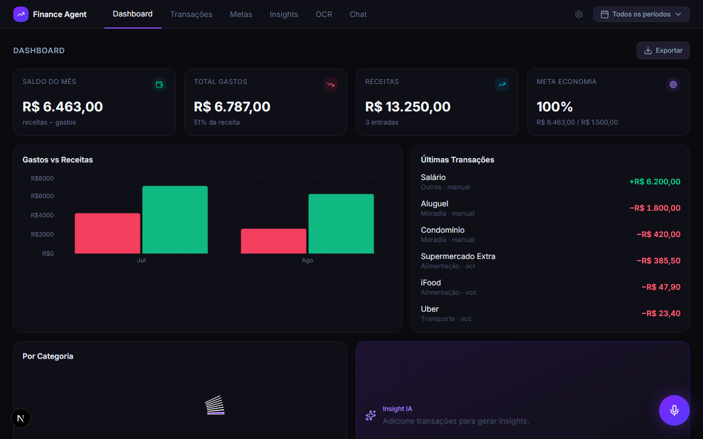

# Finance Agent

[](LICENSE)
[](https://nextjs.org)
[](https://www.typescriptlang.org)
[](https://tailwindcss.com)
[](https://zustand-demo.pmnd.rs)
[](https://ollama.com)
[](https://vitest.dev)

> Agente financeiro pessoal local e offline. Registre gastos por texto, voz ou foto de recibo — a IA categoriza, analisa e responde perguntas sobre suas finanças.

**[→ Ver demo ao vivo](https://finance-agent-blue.vercel.app)**

## O problema

Ferramentas de gestão financeira pessoal quase sempre exigem enviar seus dados bancários pra nuvem de terceiros. O Finance Agent nasceu como o oposto disso: um agente que roda inteiramente na sua máquina — dados em JSON local, IA via Ollama — sem nenhuma chamada de rede pra fora do seu computador.

## Decisão de arquitetura: self-hosted vs. demo

O produto real é **local-first por padrão**. Mas avaliar um projeto clonando o repo e instalando Ollama é fricção demais pra um portfólio — então a demo pública acima roda num modo diferente, isolado por uma camada de repository:

| | Self-hosted (produto real) | Demo pública |
|---|---|---|
| Dados | JSON no seu disco (`data/`) | `localStorage` do seu navegador — isolado por visitante, nunca compartilhado |
| IA | Ollama, 100% local e offline | Groq (modelo aberto Llama, hospedado) |
| Como ativar | Padrão, nada a configurar | `NEXT_PUBLIC_APP_MODE=demo` + `AI_PROVIDER=groq` |

A troca é feita por uma interface `TransactionRepository`/`ConfigRepository` (`lib/repositories/`) e um `AIProvider` (`services/ai/`) — o resto do app não sabe em qual modo está rodando.

## Screenshots




## Funcionalidades

### Gestão de Transações
- Adicionar gastos e receitas manualmente, por voz ou via OCR (foto de recibo)
- Editar e deletar transações
- Categorização automática por IA com fallback por palavras-chave
- Busca e filtro por período

### Dashboard
- Cards de saldo, gastos, receitas e progresso da meta de economia
- Gráfico de gastos por categoria e evolução mensal
- Banner de insight gerado por IA

### Metas
- Meta de economia mensal com barra de progresso
- Limites por categoria com alertas visuais (âmbar 80%, vermelho 100%+)

### Insights e Chat Financeiro
- Análise financeira gerada pela IA com base nas transações do período
- Chat com contexto financeiro opcional, com histórico de sessão

### OCR e Voz
- Upload de foto ou PDF de recibo, extração automática via Tesseract.js
- Entrada e saída por voz (Modo Jarvis) via Web Speech API

### Configurações
- URL e modelo do Ollama configuráveis (self-hosted)
- Status do sistema em tempo real
- Meta de economia, moeda global (BRL/USD/EUR), backup JSON

### PWA
- Instalável a partir do navegador (Chrome/Edge) via manifest + service worker

## Tech Stack

| Camada | Tecnologia |
|--------|-----------|
| Framework | Next.js 16 (App Router) |
| Linguagem | TypeScript |
| Estilo | Tailwind CSS + shadcn/ui |
| Estado | Zustand |
| IA | Ollama (self-hosted) / Groq (demo) — arquitetura plugável |
| OCR | Tesseract.js |
| Voz | Web Speech API |
| Gráficos | Recharts |
| PDF | jsPDF + jspdf-autotable |
| Dados | JSON local (self-hosted) / localStorage (demo) — arquitetura plugável |
| Testes | Vitest + jsdom + Testing Library |

## Rodando localmente (self-hosted)

```bash
git clone https://github.com/Liraas-v/FINANCE-AGENT.git
cd FINANCE-AGENT
npm install

ollama pull tinyllama   # ~600 MB, funciona com pouca RAM
ollama serve

npm run dev
```

Acesse [http://localhost:3000](http://localhost:3000) — redireciona pro dashboard. Em `/settings`, configure o modelo do Ollama, a moeda e sua meta de economia.

## Rodando o modo demo localmente

```bash
cp .env.example .env.local
# edite .env.local: NEXT_PUBLIC_APP_MODE=demo, AI_PROVIDER=groq, GROQ_API_KEY=sua-chave
npm run dev
```

## Testes

```bash
npx vitest run
```

Cobre funções puras (`db`, `parser`, `categories`, `currency`), os repositórios de dados, o `AIProvider` e as rotas de API (`transactions`, `config`, `ai/*`).

## API Routes

| Método | Rota | Descrição |
|--------|------|-----------|
| GET | `/api/transactions` | Lista transações (filtros: `from`, `to`, `tipo`, `categoria`) |
| POST | `/api/transactions` | Adiciona uma transação |
| PATCH | `/api/transactions/[id]` | Atualiza uma transação |
| DELETE | `/api/transactions` | Remove todas as transações |
| DELETE | `/api/transactions/[id]` | Remove uma transação |
| GET/PATCH | `/api/config` | Lê/atualiza configuração |
| GET | `/api/ai/status` | Status do provider de IA ativo |
| GET | `/api/ai/models` | Modelos disponíveis no provider ativo |
| POST | `/api/ai/chat` | Chat com contexto financeiro opcional |
| POST | `/api/ai/analyze` | Categoriza uma transação por IA |
| POST | `/api/ai/insights` | Gera insights financeiros |
| POST | `/api/ocr` | Extrai dados de imagem/PDF |

## Limitações conhecidas

- **Web Speech API** — só funciona em Chrome/Edge, em `localhost` ou HTTPS
- **Chat** — histórico não persiste entre reloads (session-only por design)
- **Demo pública** — dados vivem só no seu navegador; limpar o localStorage reseta pro seed inicial

## Licença

Distribuído sob a licença [MIT](LICENSE).
