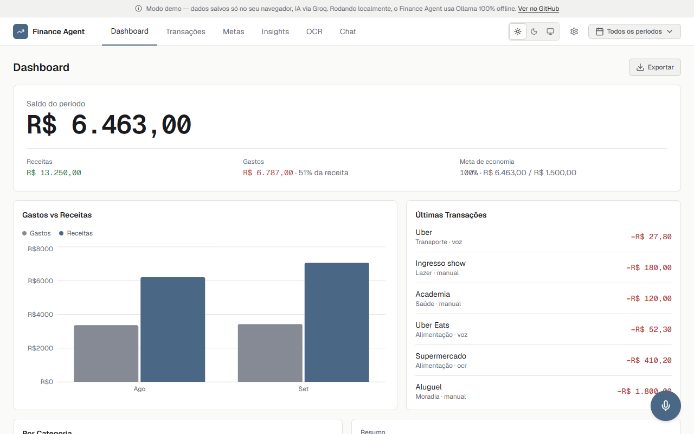
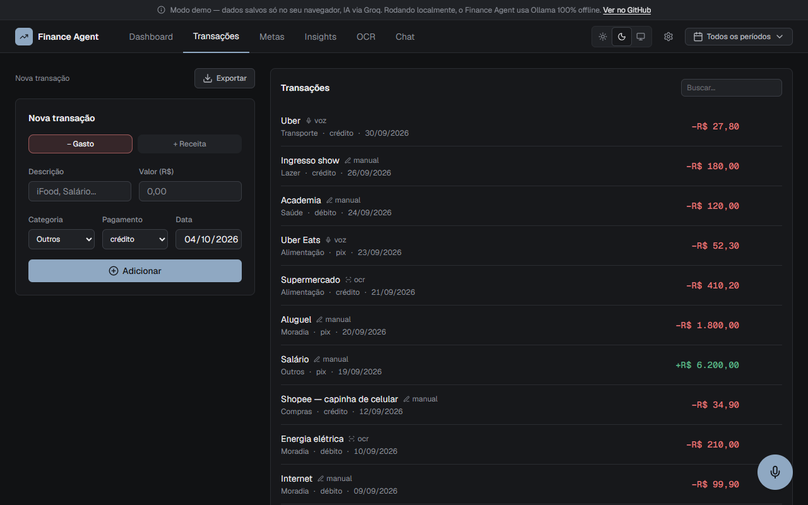
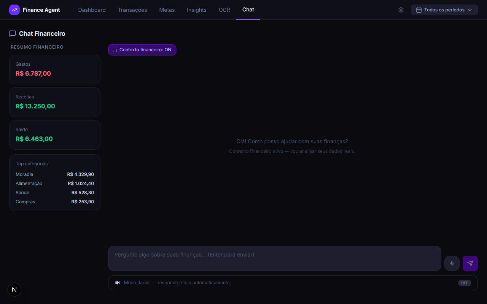
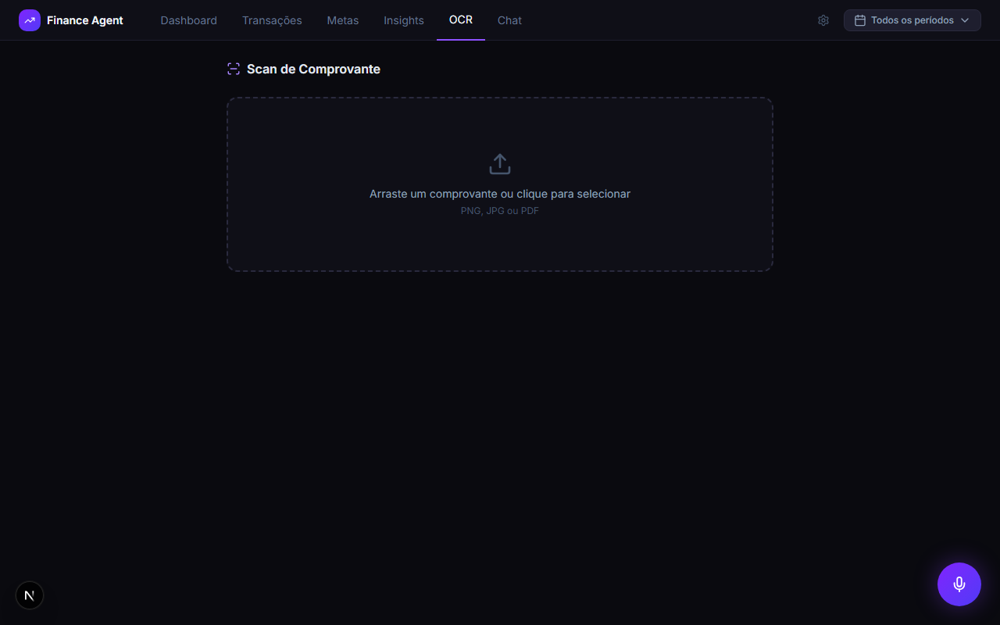

# Personal Finance Agent

**Português** · [English](README.en.md)

[](https://github.com/Liraas-v/personal-finance-agent/actions/workflows/ci.yml)
[](LICENSE)
[](https://nextjs.org)
[](https://www.typescriptlang.org)
[](https://tailwindcss.com)
[](https://ollama.com)
[](https://vitest.dev)

> Agente financeiro pessoal local-first. Registre gastos por texto, voz ou foto de recibo; a IA categoriza, analisa e responde perguntas sobre as suas finanças.

**[→ Ver demo ao vivo](https://finance-agent-blue.vercel.app)**

<picture>
  <source media="(prefers-color-scheme: dark)" srcset="public/screenshots/dashboard-dark.png">
  
</picture>

## O problema

Ferramentas de gestão financeira pessoal quase sempre exigem enviar os seus dados bancários para a nuvem de terceiros. Este projeto nasceu como o oposto disso: um agente que roda inteiramente na sua máquina (dados em JSON local, IA via Ollama), sem nenhuma chamada de rede para fora do seu computador.

## Decisão de arquitetura: self-hosted vs. demo

O produto real é **local-first por padrão**. Mas avaliar um projeto clonando o repositório e instalando o Ollama é fricção demais para um portfólio. Por isso a demo pública roda em outro modo, isolado por uma camada de repositórios:

| | Self-hosted (produto real) | Demo pública |
|---|---|---|
| Dados | JSON no seu disco (`data/`) | `localStorage` do navegador, isolado por visitante |
| IA | Ollama, 100% local e offline | Groq (modelo aberto hospedado) |
| Como ativar | Padrão, nada a configurar | `NEXT_PUBLIC_APP_MODE=demo` + `AI_PROVIDER=groq` |

A troca é feita por interfaces `TransactionRepository`/`ConfigRepository` (`lib/repositories/`) e por um `AIProvider` (`services/ai/`). O resto do app não sabe em qual modo está rodando.

## Funcionalidades

- **Transações:** adicione gastos e receitas por texto, voz ou foto de recibo (OCR); edite, remova, busque e filtre por período. A categorização é feita por IA, com fallback por palavras-chave.
- **Dashboard:** saldo do período em destaque, receitas, gastos e progresso da meta; gráfico de gastos vs receitas, gastos por categoria e resumo gerado por IA.
- **Metas:** meta de economia mensal e limites por categoria, com alertas visuais acima de 80% e de 100%.
- **Insights e chat financeiro:** análise do período pela IA e conversa com contexto financeiro opcional.
- **OCR e voz:** upload de foto ou PDF de recibo (Tesseract.js) e entrada e saída por voz (Web Speech API).
- **Tema claro e escuro:** segue o sistema, com seletor no cabeçalho e em Configurações.
- **Configurações:** URL e modelo do Ollama, moeda (BRL/USD/EUR), meta de economia e backup em JSON.
- **PWA:** instalável pelo navegador (Chrome/Edge).

## Screenshots





## Stack

| Camada | Tecnologia |
|--------|-----------|
| Framework | Next.js 16 (App Router) |
| Linguagem | TypeScript |
| Estilo | Tailwind CSS 4, shadcn/ui, `next-themes`, fonte Geist |
| Estado | Zustand |
| IA | Ollama (self-hosted) / Groq (demo), arquitetura plugável |
| OCR | Tesseract.js |
| Voz | Web Speech API |
| Gráficos | Recharts |
| PDF | jsPDF + jspdf-autotable |
| Dados | JSON local (self-hosted) / `localStorage` (demo), arquitetura plugável |
| Testes | Vitest + jsdom + Testing Library |
| CI | GitHub Actions |

## Começando (self-hosted)

Requer Node 20.9 ou superior e o [Ollama](https://ollama.com).

```bash
git clone https://github.com/Liraas-v/personal-finance-agent.git
cd personal-finance-agent
npm install

ollama pull tinyllama   # ~600 MB, funciona com pouca RAM
ollama serve

npm run dev
```

Acesse [http://localhost:3000](http://localhost:3000). Em `/settings`, configure o modelo do Ollama, a moeda e a meta de economia.

## Modo demo local

```bash
cp .env.example .env.local
# edite .env.local: NEXT_PUBLIC_APP_MODE=demo, AI_PROVIDER=groq, GROQ_API_KEY=sua-chave
npm run dev
```

## Scripts

| Comando | O que faz |
|---|---|
| `npm run dev` | Servidor de desenvolvimento |
| `npm run build` / `npm start` | Build e servidor de produção |
| `npm run lint` | ESLint |
| `npm run typecheck` | Verificação de tipos (`tsc --noEmit`) |
| `npm test` / `npm run test:run` | Testes (modo watch / uma execução) |
| `npm run screenshots` | Captura screenshots das telas (veja `scripts/capture-screenshots.mjs`) |
| `npm run icons` | Regenera o favicon e os ícones do PWA (`scripts/generate-icons.mjs`) |

## Estrutura do projeto

```
app/            rotas (App Router) e API routes
components/     componentes de interface, por área (dashboard, chat, goals…) e ui/
hooks/          hooks de dados e de interação (transações, insights, voz, tema dos gráficos)
lib/            lógica pura, tokens de gráfico e repositories/ (JSON local, API, localStorage)
services/ai/    AIProvider (Ollama e Groq) e construção de prompts
tests/          testes unitários, de componentes e de API
scripts/        utilitários (captura de screenshots)
public/         ícone, manifest, service worker e screenshots
```

## Testes e CI

```bash
npm run test:run
```

A suíte cobre funções puras, repositórios, `AIProvider`, rotas de API e componentes. Dois testes protegem o design: um bloqueia cores hardcoded e fora do padrão em `app/` e `components/`, e outro valida o contraste WCAG dos dois temas lendo o próprio CSS. O CI roda lint, typecheck, testes e build a cada pull request.

## API

| Método | Rota | Descrição |
|--------|------|-----------|
| GET | `/api/transactions` | Lista transações (filtros: `from`, `to`, `tipo`, `categoria`) |
| POST | `/api/transactions` | Adiciona uma transação |
| PATCH | `/api/transactions/[id]` | Atualiza uma transação |
| DELETE | `/api/transactions` | Remove todas as transações |
| DELETE | `/api/transactions/[id]` | Remove uma transação |
| GET/PATCH | `/api/config` | Lê/atualiza a configuração |
| GET | `/api/ai/status` | Status do provider de IA ativo |
| GET | `/api/ai/models` | Modelos disponíveis no provider ativo |
| POST | `/api/ai/chat` | Chat com contexto financeiro opcional |
| POST | `/api/ai/analyze` | Categoriza uma transação por IA |
| POST | `/api/ai/insights` | Gera insights financeiros |
| POST | `/api/ocr` | Extrai dados de imagem ou PDF |

## Roadmap

- [x] Redesign visual com tema claro e escuro
- [x] CI e documentação bilíngue
- [x] Reorganização de UX por tela (metas, transações, chat, insights, mobile)
- [ ] Categorias personalizadas
- [ ] Testes end-to-end

## Limitações conhecidas

- **Web Speech API:** só funciona em Chrome/Edge, em `localhost` ou HTTPS.
- **Chat:** o histórico não persiste entre recarregamentos (por design).
- **Demo pública:** os dados vivem só no seu navegador; limpar o `localStorage` volta ao seed inicial.

## Contribuindo

Veja o [guia de contribuição](CONTRIBUTING.md) e o [changelog](CHANGELOG.md).

## Licença

Distribuído sob a licença [MIT](LICENSE).
